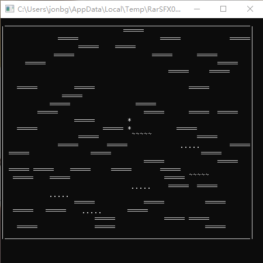

# Doodle  Jump

用 C 语言在命令行下复刻经典手机游戏涂鸦跳跃。

## 介绍	Introduction

> 把红旗插上无穷的高峰！

向上跳跃，不要坠入虚空！

## 玩法	Howto

用方向键操纵小人左右移动，当小人落在跳板上时会向上弹起。

左移： <kbd>A</kbd> 或 <kbd>←</kbd> 

右移： <kbd>D</kbd> 或 <kbd>→</kbd> 

## 截图	Screenshots

## 主要贡献者	Main Contributors

[@lhy](https://github.com/lhy1210302421) ：Backend Developer

[@lz](https://nlstudio.coding.net/u/PAzwnJgvDc) ：Frontend Developer

[@Jonbgua](https://github.com/JiangGua) ：Program Manager, Software Architect